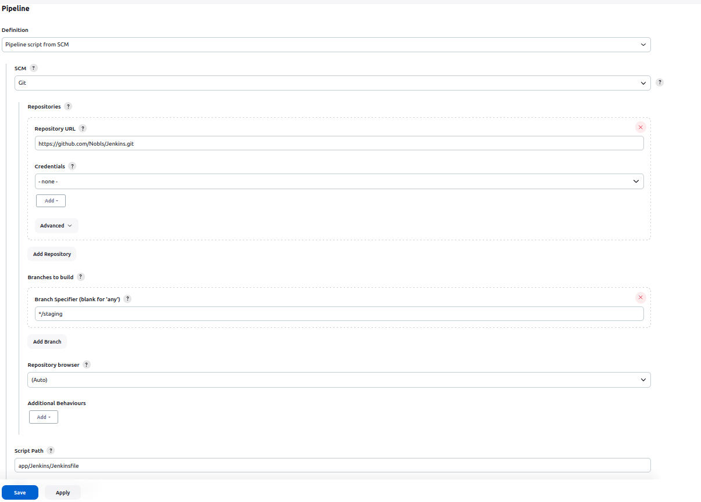
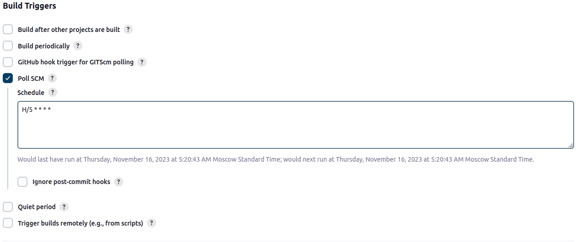
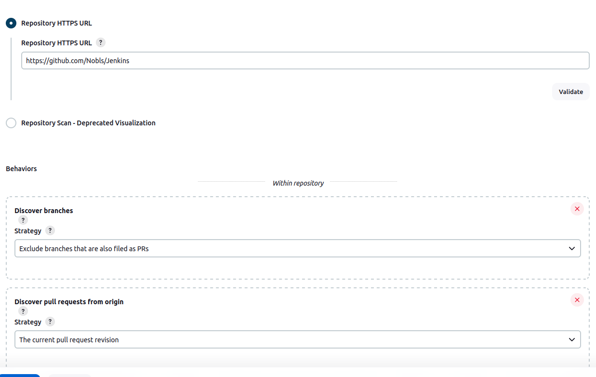
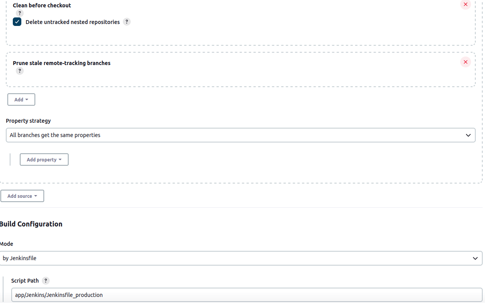
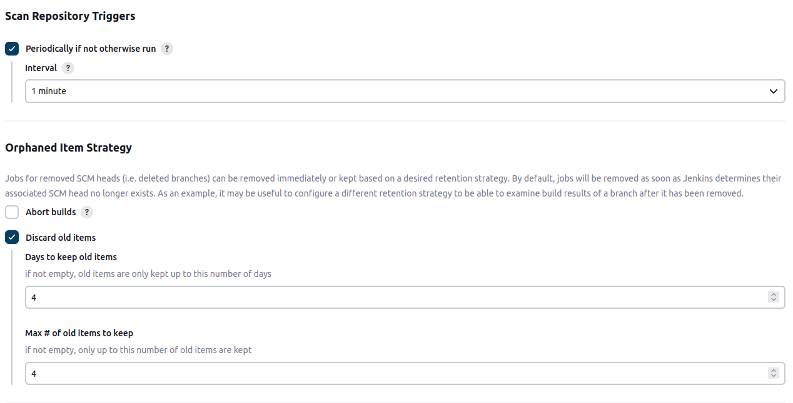

# Jenkins

Для установки Jenkins был сздан скрипт. 

```
sudo apt-get update
sudo apt-get install openjdk-17-jdk
sudo apt-get update
sudo wget -O /usr/share/keyrings/jenkins-keyring.asc \
  https://pkg.jenkins.io/debian-stable/jenkins.io-2023.key
echo deb [signed-by=/usr/share/keyrings/jenkins-keyring.asc] \
  https://pkg.jenkins.io/debian-stable binary/ | sudo tee \
  /etc/apt/sources.list.d/jenkins.list > /dev/null
sudo apt-get update
sudo apt-get install jenkins
```

Был создан Dockerfile для сборки образа приложения.

```
# Используем Node.js 18.4
FROM node:18.4

# Создаем рабочую директорию
WORKDIR /app

# Копируем исходный код в рабочую директорию
COPY . .

# Устанавливаем зависимости с использованием yarn
RUN yarn install

# Собираем приложение
RUN yarn build

# Запускаем приложение
EXPOSE 3000
CMD ["yarn", "start"]

```

Был cоздан пайплайн для Staging, где былм включены шаги: сборка, бэкап и деплой.

```
/* groovylint-disable-next-line CompileStatic */
pipeline {
    agent any

    options {
        timestamps()
    }

    stages {
        stage('Build') {
            steps {
                echo '====start building image===='
                dir('app') {
                    sh 'docker build -t app .'
                }
            }
        }

        stage('Backup') {
            when {
                expression { currentBuild.resultIsBetterOrEqualTo('SUCCESS') }
            }
            steps {
                echo '====start creating backup===='
                script {
                   sh 'mkdir -p /var/lib/jenkins/workspace/Staging/backup-directory'
                }
                sh 'docker save app -o /var/lib/jenkins/workspace/Staging/backup-directory/app-artifact.tar'
                echo '====backup completed===='
            }
        }

        stage('Deploy') {
            when {
                expression { currentBuild.resultIsBetterOrEqualTo('SUCCESS') }
            }
            steps {
                echo '====start deploying application===='
                sh 'docker run -d -p 3000:3000 app'
            }
        }
    }
}
```
Была добавлена опция **timestamps()** для возможности отслеживания временных меток, что может помочь отслеживать, сколько времени занимает каждый этап.


Был cоздан пайплайн для Production, где былм включены шаги: сборка, бэкап и деплой.

```
/* groovylint-disable-next-line CompileStatic */
pipeline {
    agent any

    options {
        timestamps()
    }

    stages {
        stage('Build Production') {
            steps {
                echo '====start building Production image===='
                dir('app') {
                    sh 'docker build -t production-app .'
                }
            }
        }

        stage('Backup Production') {
            when {
                expression { currentBuild.resultIsBetterOrEqualTo('SUCCESS') }
            }
            steps {
                echo '====start creating backup===='
                script {
                    sh 'mkdir -p /var/lib/jenkins/workspace/Production/backup-directory-production'
                }
                    sh 'docker save app -o /var/lib/jenkins/workspace/Production/backup-directory-production/app-artifact.tar'
                echo '====backup completed===='
            }
        }

        stage('Deploy Production') {
            when {
                expression { currentBuild.resultIsBetterOrEqualTo('SUCCESS') }
            }
            steps {
                echo '====start deploying Production application===='
                sh 'docker run -d -p 4000:3000 production-app'
            }
        }
    }
}
```

Для получения доступа к Git репозиторию пайплайн был настроено следующим образом.



Так как сборка выполнялась локально, то отслеживание изменений в Git было настроено следующим образом.



Аналогичным образом был настроен проект для Production.

Для настройки автоматического запуска деплоя при подтверждении pull request'а в ветке "main" в Git был выбран Multibranch Pipeline. В нем были произведены следующие настройки.





